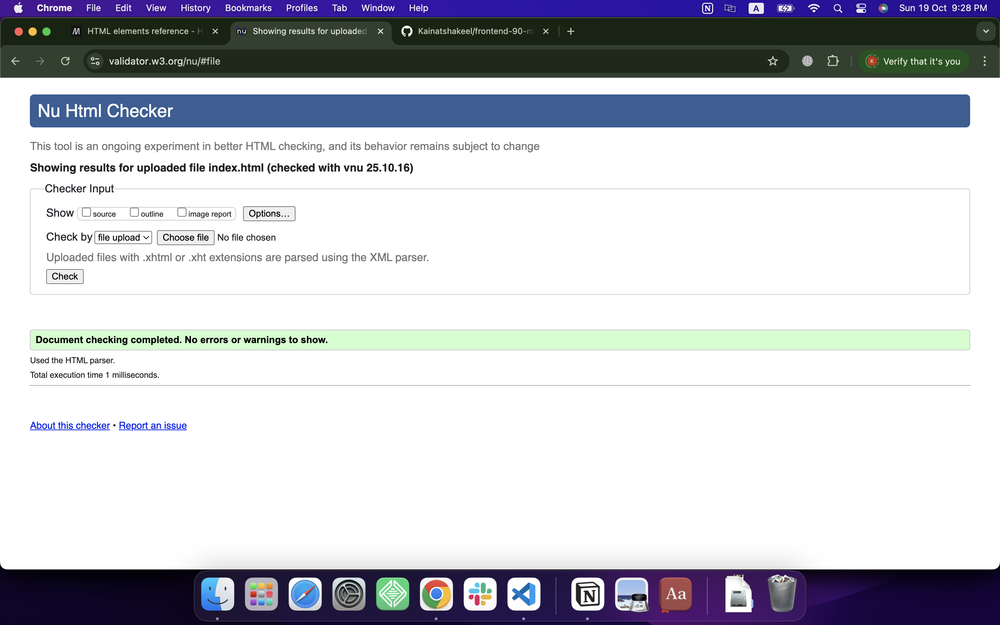
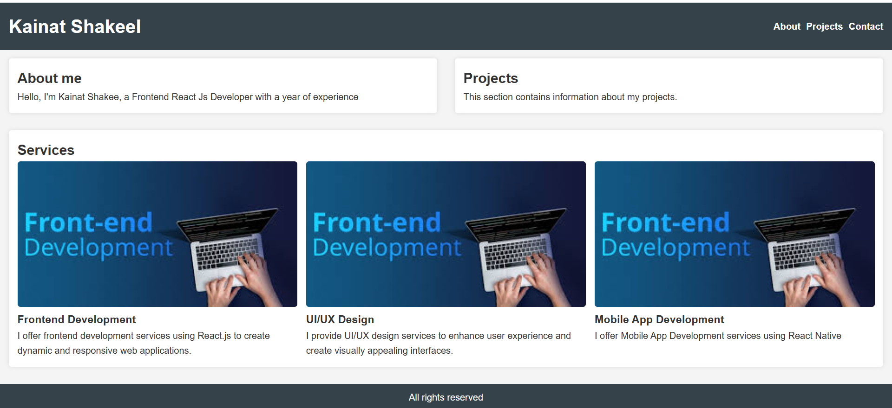
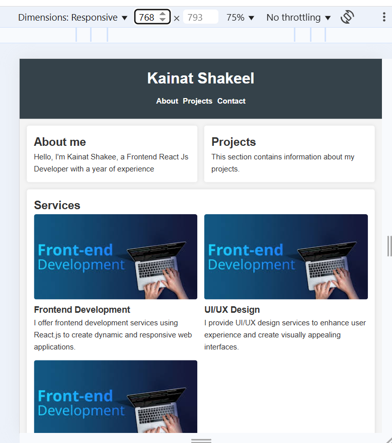
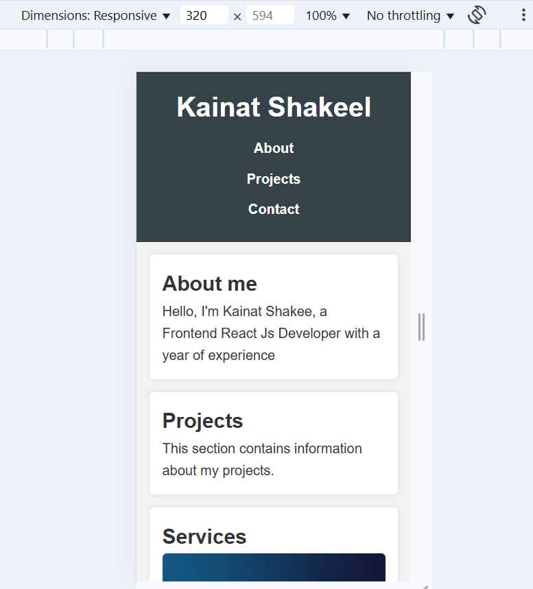
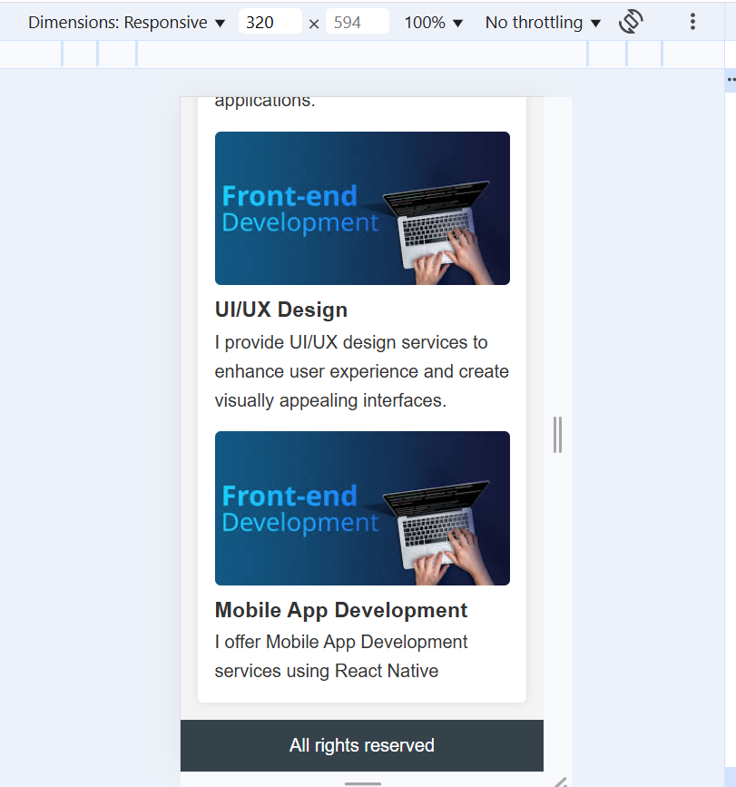

# frontend-90-roadmap

This is the Day 1 deliverable for the frontend 90 roadmap.

## ✅ Semantic HTML Structure

Created `index.html` using semantic elements: `<header>`, `<nav>`, `<main>`, `<section>`, and `<footer>`.

## ✅ HTML Validation Report

